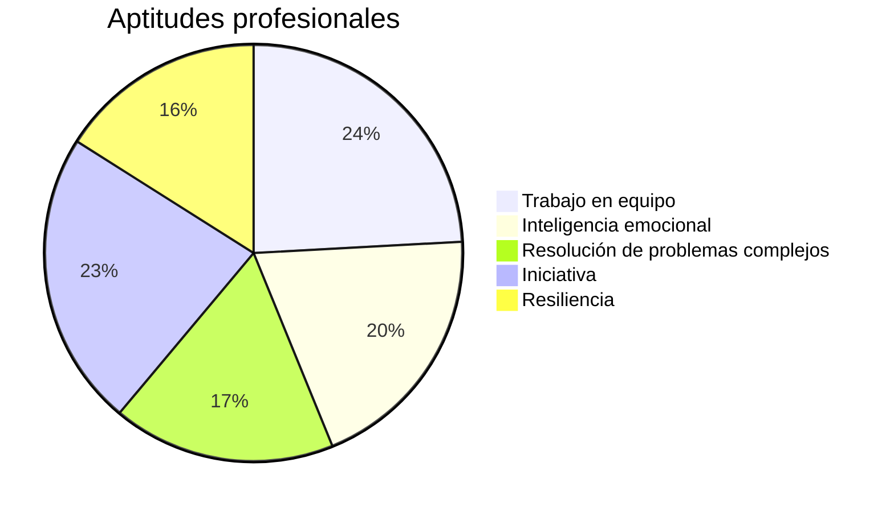

<!-- Main -->

<!-- One -->
<section id="one">
	

		<header class="major">
			<h1>Acerca de mi</h1>
		</header>

<!-- Content -->
<h2 id="content">¿Cómo me describo?</h2>

Me considero una persona entusiasta con el mundo de la tecnología.  Me encanta aprender nuevas cosas no solo del mundo de la tecnología. Soy una persona introvertida, pero si me hablan no paro de charlar Me entusiasma mucho la música rock, clásica, metalera y electrónica. Y ahora comienzo con el mundo del deporte, me gusta ejercitarme como otra forma de desestresarme y sentirme mejor conmigo mismo. Soy una persona fácil de llevar, si se abren conmigo pueden encontrar a un amigo. Algo que puede describirme concretamente es que no puedo dejar dudas en el aire y siempre busco la manera de solucionar, hasta lo último, los problemas que se me presentan tanto a nivel personal como técnico de mi carrera. Y aunque me encanta mi país Guatemala, me gustaría algún día conocer otros países como Alemania. Más que todo porque soy seguidor del Bayern de Múnich y me encanta el fútbol de Europa.

<!-- Aptitudes -->
<h2 id="content">Aptitudes profesionales</h2>
<dl>
	<dt><u>Trabajo en equipo</u></dt>
	<dd>
		
Me gusta trabajar en equipo porque puedo aprender de otras personas y ellos de mi. Tengo buena comunicación con todo tipo de personas para lograr los objetivos que nos propongamos.

	</dd>
	<dt><u>Inteligencia emocional</u></dt>
	<dd>
		
Trabajo constantemente en mi inteligencia emocional para evitar conflictos irracionales con las personas ya que estos conflictos no ayudan al querer obtener una convivencia sana.

	</dd>
	<dt><u>Resolución de problemas complejos</u></dt>
	<dd>
		
Me gusta participar en la resolución de problemas complejos porque me ayudan a aprender nuevas cosas que tal vez en el momento ni siquiera sabía que exístiesen o que pudieran realizarse.

	</dd>
	<dt><u>Iniciativa</u></dt>
	<dd>
		
Soy una persona con iniciativa que siempre busca innovar e ir más allá de lo que se busca inicialmente al comenzar un proyecto cuando hay oportunidad.

	</dd>
	<dt><u>Resiliencia</u></dt>
	<dd>
		
Siempre busco adaptarme a las adversidades con calma y tratando de no complicar los problemas que ya exísten, trabajando en ello con paciencia.

	</dd>
</dl>

	
<h2 id="content">Mis objetivos</h2>

	<!-- Break -->
	

		<h3>En el campo Laboral</h3>
		
Ser una persona eficiente y calificada para realizar diferentes tareas que tengan que ver con la electrónica y la automatización de tareas.

	

	

		<h3>En el campo de la Automatización</h3>
		
Contribuir en el ámbito industrial ya que esto me hará aprender de los demás y así yo podré aportar a este sector tan apasionante.

	

	

		<h3>En la Robótica</h3>
		
Trabajar en el mundo de la robótica a nivel industrial y tal vez algún día crear mi propio proyecto que sea de aporte para mi país a nivel educativo y económico.

	

	

<!-- Box -->
<h3>Mis anhelos en la vida</h3>

	
Quisiera convertirme en la mejor versión de mi persona, motivando a las personas a buscar sus objetivos, tratar de apoyar en lo que pueda a las personas que conozca, nunca conformarme con nada, mantenerme siempre proactivo y dejar una huella dentro de la sociedad y mejor aún en el ámbito tecnológico. 

	

<!-- Blockquote -->
<h3>Cita favorita</h3>
<blockquote>Tus suposiciones son tus ventanas al mundo. Límpialas de vez en cuando o no entrará la luz.
<h4>-Isaac Asimov</h4></blockquote>

</section>

	

