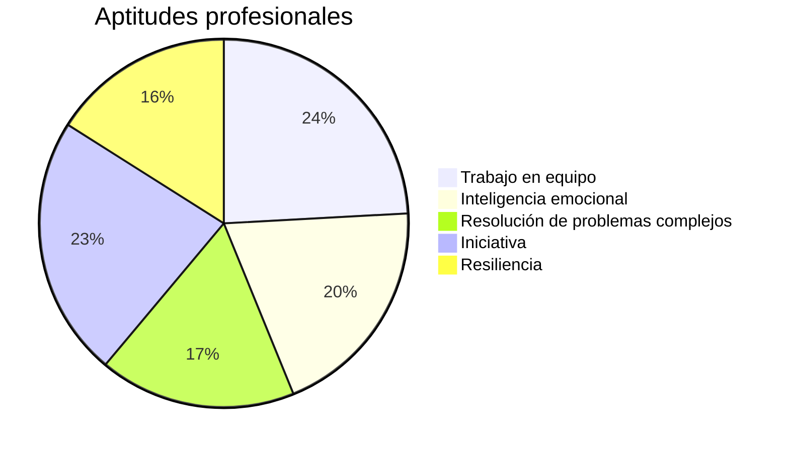

<!-- Main -->

<!-- One -->
<section id="one">
	

		<header class="major">
			<h1>About me</h1>
		</header>

<!-- Content -->
<h2 id="content">¿How do i describe myself?</h2>

I consider myself an enthusiastic person about the world of technology. I love learning new things not only related to technology. I am an introverted person, but if someone talks to me, I won't stop chatting. I am very passionate about rock, classical, metal, and electronic music. And now I'm getting into the world of sports; I like to exercise as another way to de-stress and feel better about myself. I am an easy-going person, and if people open up to me, they can find a friend. Something that can accurately describe me is that I can't leave doubts in the air, and I always look for ways to solve problems that arise, both personally and technically in my career. And although I love my country Guatemala, I would like to someday visit other countries like Germany, mainly because I am a fan of Bayern Munich and I love European football.

<!-- Aptitudes -->
<h2 id="content">Proffesional skills</h2>
<dl>
	<dt><u>Teamwork</u></dt>
	<dd>
		
I enjoy working in a team because I can learn from others and they can learn from me. I have good communication skills with all types of people in order to achieve the goals we set.

	</dd>
	<dt><u>Emotional intelligence</u></dt>
	<dd>
		
I constantly work on my emotional intelligence to avoid irrational conflicts with people as these conflicts do not contribute to fostering healthy relationships.

	</dd>
	<dt><u>Ability to solve complex problems</u></dt>
	<dd>
		
I enjoy participating in solving complex problems because it helps me learn new things that I may not have known existed or were possible before.

	</dd>
	<dt><u>Initiative</u></dt>
	<dd>
		
I am a person with initiative who always seeks to innovate and go beyond what is initially sought when starting a project, whenever there is an opportunity.

	</dd>
	<dt><u>Resilience</u></dt>
	<dd>
		
I always try to adapt to adversities calmly and avoid complicating existing problems, working on them patiently.

	</dd>
</dl>

	
<h2 id="content">Mis objetivos</h2>

	<!-- Break -->
	

		<h3>En el campo Laboral</h3>
		
Ser una persona eficiente y calificada para realizar diferentes tareas que tengan que ver con la electrónica y la automatización de tareas.

	

	

		<h3>En el campo de la Automatización</h3>
		
Contribuir en el ámbito industrial ya que esto me hará aprender de los demás y así yo podré aportar a este sector tan apasionante.

	

	

		<h3>En la Robótica</h3>
		
Trabajar en el mundo de la robótica a nivel industrial y tal vez algún día crear mi propio proyecto que sea de aporte para mi país a nivel educativo y económico.

	

	

<!-- Box -->
<h3>Mis anhelos en la vida</h3>

	
Quisiera convertirme en la mejor versión de mi persona, motivando a las personas a buscar sus objetivos, tratar de apoyar en lo que pueda a las personas que conozca, nunca conformarme con nada, mantenerme siempre proactivo y dejar una huella dentro de la sociedad y mejor aún en el ámbito tecnológico. 

	

<!-- Blockquote -->
<h3>Cita favorita</h3>
<blockquote>Tus suposiciones son tus ventanas al mundo. Límpialas de vez en cuando o no entrará la luz.
<h4>-Isaac Asimov</h4></blockquote>

</section>

	

