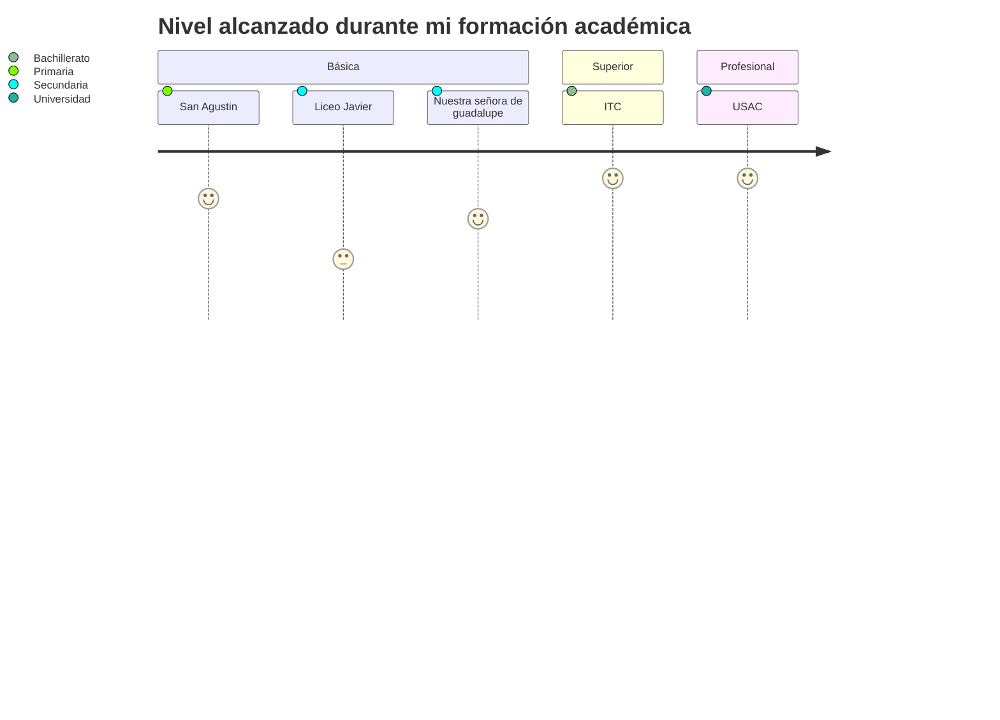

## Basic education
I studied my basic education at a school in zone 5 of the capital city of Guatemala. The name of the school is San Agustin, where I studied from preschool to sixth grade. Later, I studied first and second year of lower secondary education at Liceo Javier, located on Aguilar Batres Boulevard between Guatemala and the municipality of Villa Nueva, during the afternoon session. I studied third year of lower secondary education at Colegio Nuestra Señora de Guadalupe, located in zone 10 of the capital city of Guatemala.   

---

## Higher education
In my higher education, I have studied a degree in computer science. I completed my studies at the Institute of Technology in Computing (ITC), located in zone 1 of the capital city of Guatemala. During my degree, I learned the fundamentals of mathematics and physics, which would later help me during my university career. However, my main focus was on technical aspects such as programming, including the implementation of software in languages such as Java and the now almost obsolete Visual Basic .NET. Additionally, I learned about the basics of both relational and non-relational databases, as well as commonly used office programs such as Word and Excel that are essential in almost any workplace.

---

## University
I have studied Electronics Engineering at the University of San Carlos of Guatemala. During my degree, I learned to design circuit boards for electronic devices and design electronic devices for various applications. Some examples of these applications include:

- Active oscillators and filters
- Household transfer switch
- Implementation of an X10 protocol
- And other applications based in the use of transistors, operational amplifiers, optocouplers and different sensors (everything that can be learn in a career in electronics). 

I also learned how to program microcontrollers and programmable logic gate arrays (FPGAs). I used the C language to program microcontrollers, using boards such as those produced by Texas Instruments. For programming FPGAs, I used the VHDL specification language. Some of the projects I worked on in this area during my degree include:

- A sign that utilizes persistence of vision
- A battleship game
- Other applications for various courses

During my degree, I also learned about telecommunications. In this area, I learned about both analog and digital communication techniques for different applications. I gained a strong foundation in mathematics and statistics to model communication systems. I also learned about signal distortion and noise due to different environmental factors affecting signal transmission. This area also includes designing and managing networks to connect different equipment within a company, such as switches and routers, to provide internet services and facilitate communication between different departments.

In the field of automation, I learned about electrical instrumentation that is used to collect data from various types of resistive, capacitive, and inductive sensors. We also studied instrumentation symbology and diagrams that show how certain parts of an industrial process are implemented. I also learned how to apply control systems to maintain a process under specific conditions to ensure proper operation. Finally, I gained experience in block language programming for intelligent relays and ladder language programming used in PLCs, equipment used to manage industrial machinery.

---

## Online education
### Curso Métodos Numéricos con Aplicaciones de Ingeniería en UDEMY por parte de zDynamics
Durante el curso aprendí mejore mi entendimiento sobre los métodos númericos aplicados a problemas reales de la ingeniería. Como encontrar raíces de una o múltiples variables, optimización de funciones, ajuste de curvas de funciones con interpolación polinómica y splines, integración númerica y la diferenciación númerica. Para lo cual aprendí diferentes métodos para realizar este tipo de operaciones que resultan efectivas al momento de querer emplearlos en microcontroladores, PLC'S y aplicaciones de simulación y resolución de problemas utilizando principalmente el lenguaje Python y el software MATLAB.

### Curso de Control de Sistemas Dinámicos en UDEMY
En este curso mejore mis habilidades al proponer funciones de control P, PD, PI, PID. También controles adaptables para ciertos sistemas donde se desconocen los parámetros físicos de funcionamiento, de por ejemplo motores. Y algo un poco más reciente que es el control difuso utilizado para crear una especie de razonamiento de una máquina pero donde el humano impone las reglas para determinar la respuesta de la máquina; algo parecido a establecer que es frío y que es caliente, según lo medido por un sensor. En el curso vi ejemplos de todos estos conceptos desarrollados en el lenguaje de Python y algunas simulaciones desarrolladas en MATLAB y en Simulink. Gracias a este curso aprendí a utilizar Simulink para realizar simulaciones de funciones de control.

### Curso de Robótica: de la cinemática al control
Durante el curso aprendí sobre como controlar, en su mayoría robots seriales, en el espacio de las articulaciones y el de la tarea. Esto aprendiendo a sacar los parámetros Denavit-Hartenberg del robot para posteriormente modelar la geometría del robot (cinemática directa e inversa) y luego pasar a su sistema dinámico; cuyo control se realizaba por medio de funciones de control como el controlador PD con compensación de la gravedad. Y por supuesto aprendí a plantear el modelo dinámico del robot basado en el propio movimiento del robot y factores externos que afectan su comportamiento como la gravedad, el rozamiento viscoso y el rozamiento de coulomb. 

La matemática para aprender todo lo descrito anteriormente fueron las matrices de transformación homógenea y los cuaterniones duales. 

### Curso de  Oleo hidráulica y neumática
Durante el curso aprendí principios físicos sobre la neumática y la oleo hidráulica. También los dispositivos más importantes que se utilizan para el diseño de circuitos neumáticos y oleohidráulicos. Esto incluye el uso de actuadores, válvulas direccionales, bombas, válvulas antirretorno, válvulas de prellenado, entre otros dispositivos. Todo esto me ayudó a comprender el funcionamiento de diferentes maquinarias que utilizan neumática u oleo hidráulica que se utilizan a nivel industrial.

Otra parte importante que aprendí fue a diseñar redes de aire comprimido y a diseñar la instalación basado en criterios como las pérdidas que hay en la instalación, el diámetro apropiado para las tuberías, el compresor y el consumo de cada circuito a conectar. Todo esto para redes abiertas, cerradas e interconectadas. 

