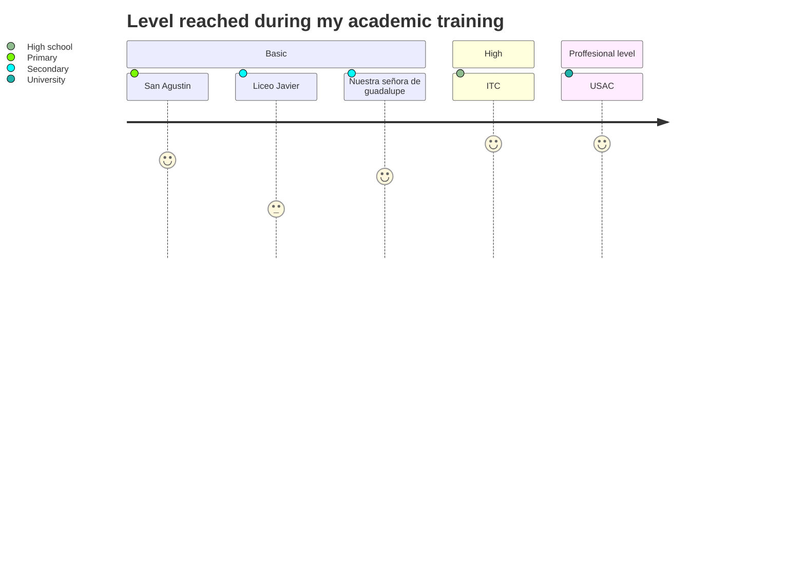

## Basic education
I studied my basic education at a school in zone 5 of the capital city of Guatemala. The name of the school is San Agustin, where I studied from preschool to sixth grade. Later, I studied first and second year of lower secondary education at Liceo Javier, located on Aguilar Batres Boulevard between Guatemala and the municipality of Villa Nueva, during the afternoon session. I studied third year of lower secondary education at Colegio Nuestra Señora de Guadalupe, located in zone 10 of the capital city of Guatemala.   

---

## Higher education
In my higher education, I have studied a degree in computer science. I completed my studies at the Institute of Technology in Computing (ITC), located in zone 1 of the capital city of Guatemala. During my degree, I learned the fundamentals of mathematics and physics, which would later help me during my university career. However, my main focus was on technical aspects such as programming, including the implementation of software in languages such as Java and the now almost obsolete Visual Basic .NET. Additionally, I learned about the basics of both relational and non-relational databases, as well as commonly used office programs such as Word and Excel that are essential in almost any workplace.

---

## University
I have studied Electronics Engineering at the University of San Carlos of Guatemala. During my degree, I learned to design circuit boards for electronic devices and design electronic devices for various applications. Some examples of these applications include:

- Active oscillators and filters
- Household transfer switch
- Implementation of an X10 protocol
- And other applications based in the use of transistors, operational amplifiers, optocouplers and different sensors (everything that can be learn in a career in electronics). 

I also learned how to program microcontrollers and programmable logic gate arrays (FPGAs). I used the C language to program microcontrollers, using boards such as those produced by Texas Instruments. For programming FPGAs, I used the VHDL specification language. Some of the projects I worked on in this area during my degree include:

- A sign that utilizes persistence of vision
- A battleship game
- Other applications for various courses

During my degree, I also learned about telecommunications. In this area, I learned about both analog and digital communication techniques for different applications. I gained a strong foundation in mathematics and statistics to model communication systems. I also learned about signal distortion and noise due to different environmental factors affecting signal transmission. This area also includes designing and managing networks to connect different equipment within a company, such as switches and routers, to provide internet services and facilitate communication between different departments.

In the field of automation, I learned about electrical instrumentation that is used to collect data from various types of resistive, capacitive, and inductive sensors. We also studied instrumentation symbology and diagrams that show how certain parts of an industrial process are implemented. I also learned how to apply control systems to maintain a process under specific conditions to ensure proper operation. Finally, I gained experience in block language programming for intelligent relays and ladder language programming used in PLCs, equipment used to manage industrial machinery.

---

## Online education
### Course Numerical Methods with engineering applications by zDynamics
During the course, I improved my understanding of numerical methods applied to real engineering problems. I learned how to find roots of single or multiple variables, optimize functions, curve fitting of functions with polynomial interpolation and splines, numerical integration, and numerical differentiation. To achieve this, I learned different methods to perform these operations that are effective when employing them in microcontrollers, PLCs, and simulation and problem-solving applications mainly using Python and MATLAB software.

### Course of dynamic systems in UDEMY (certification in spanish)
In this course, I improved my skills in proposing control functions such as P, PD, PI, and PID. I also learned about adaptive controls for certain systems where the physical operating parameters are unknown, such as motors. Additionally, I learned about fuzzy control, a more recent technique used to create machine reasoning, where humans establish rules to determine the machine's response, for example, determining what is hot or cold based on sensor measurements. Throughout the course, I was introduced to various examples of these concepts developed using Python and some simulations using MATLAB and Simulink. Thanks to this course, I learned how to use Simulink for control function simulations. 

### Course of Robotics: from kinematics to control
During the course, I learned about controlling mostly serial robots in joint and task space. This was achieved by extracting the Denavit-Hartenberg parameters of the robot to model its geometry (direct and inverse kinematics), and then moving on to its dynamic system. The control was achieved through functions such as PD control with gravity compensation. Additionally, I learned how to formulate the dynamic model of the robot, taking into account its own motion and external factors that affect its behavior such as gravity, viscous friction, and Coulomb friction.

The mathematics involved in learning all of the above were homogeneous transformation matrices and dual quaternions.

### Course of hydraulic oil and pneumatic in Udemy (certification in spanish)
During the course, I learned about the physical principles of pneumatics and hydraulics. I also learned about the most important devices used in the design of pneumatic and hydraulic circuits. This includes the use of actuators, directional valves, pumps, check valves, filling valves, and other devices. All of this helped me understand the functioning of different machinery that use pneumatics or hydraulics in industrial settings.

Another important part that I learned was how to design compressed air networks and how to design the installation based on criteria such as the losses that occur in the installation, the appropriate diameter for the pipes, the compressor, and the consumption of each circuit to be connected. All of this is for open, closed, and interconnected networks.

