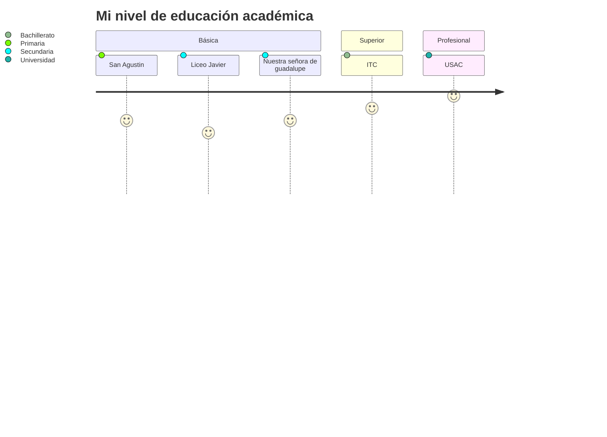

## Educación básica
Mi educación básica la estudie en un colegio en la zona 5 de la ciudad capital de Guatemala. El nombre del colegio es San Agustin. En este colegio estudié desde parvulos hasta sexto primaria. Más adelante estudié primero y segundo básico en el Liceo Javier, ubicado en la calzada Aguilar Batres entre Guatemala y el municipio de Villa Nueva, durante la jornada vespertina. Tercero básico lo estudie en el Colegio Nuestra Señora de Guadalupe ubicado en la zona 10 de la ciudad capital de Guatemala.   

---

## Educación a nivel bachiller
En mi educación superior he estudiado bachillerato en computación. En el instituto tecnológico en computación (ITC) ubicado en la zona 1 de la ciudad capital de Guatemala. Durante mi carrera aprendí los fundamentos de la matemática y física que posteriormente me ayudarían durante mi carrera universitaria. Pero principalmente he estudiado la parte técnica sobre la programación, como la implementación de software en lenguajes de Java y el ahora casi obsoleto Visual Basic .NET. Además, aprendí sobre fundamentos de bases de datos relacionales y no relacionales. Y también los programas básicos que utiliza cualquier persona en casi cualquier trabajo de oficina como lo son el word y el excel. 

---

## Educación a nivel universitario
He estudiado ingeniería en electrónica en la Universidad de San Carlos de Guatemala. Durante la carrera he aprendido a diseñar placas para dispositivos electrónicos, a diseñar dispositivos electrónicos para diferentes aplicaciones. Entre las cuales puedo mencionar: 

- Osciladores y filtros activos
- Switch de transferencia domiciliar
- Simulación de un protocolo x10
- Entre otras aplicaciones.

También he aprendido a programar microcontroladores y matrices de puertas lógicas programables en campo (FPGA´s). El uso de microcontroladores lo he aprendido en lenguaje C utilizando tarjetas como las de Texas Instruments. Y las FPGA's la he aprendido a programar utilizando el lenguaje de especificación VHDL. Los proyectos que realice durante la carrera en esta área fueron los siguientes:

- Letrero utilizando la persistencia de la visión
- Juego de battleship
- Entre otras aplicaciones para otros cursos
  
En la carrera también nos enseñaron la parte de telecomunicaciones. En esta área aprendí sobre las comunicaciones analógicas y digitales empleadas para diferentes aplicaciones. Nos dieron la base matemática y estadística para modelar un sistema de telecomunicaciones. Aquí aprendí lo que es el ruido y la distorsión de señales debido a diferentes ambientes donde se transmiten las señales. Esta área también incluye el manejo y diseño de redes con las que se conectan diferentes equipos de una compañia a través de switch's, routers, entre otros. Esto con el objetivo de lograr una comunicación entre diferentes áreas de una compañia y proporcionales servicio a internet. 

En el área de la automatización nos enseñaron instrumentación eléctrica que sirve para la adquisición de datos de diferentes sensores resistivos, capacitivos e inductivos. También aprendimos simbología y diagramas de instrumentación que nos dice como se esta implementando cierta parte de un proceso industrial. Y como aplicar sistemas de control para llevar el control de un proceso que requiera mantenerse bajo ciertas condiciones para funcionar. Y también aprendí programación en lenguaje de bloques en relés inteligentes y programación en lenguaje de escalera usado en PLC's, equipos utilizados para manejar equipo industrial.

